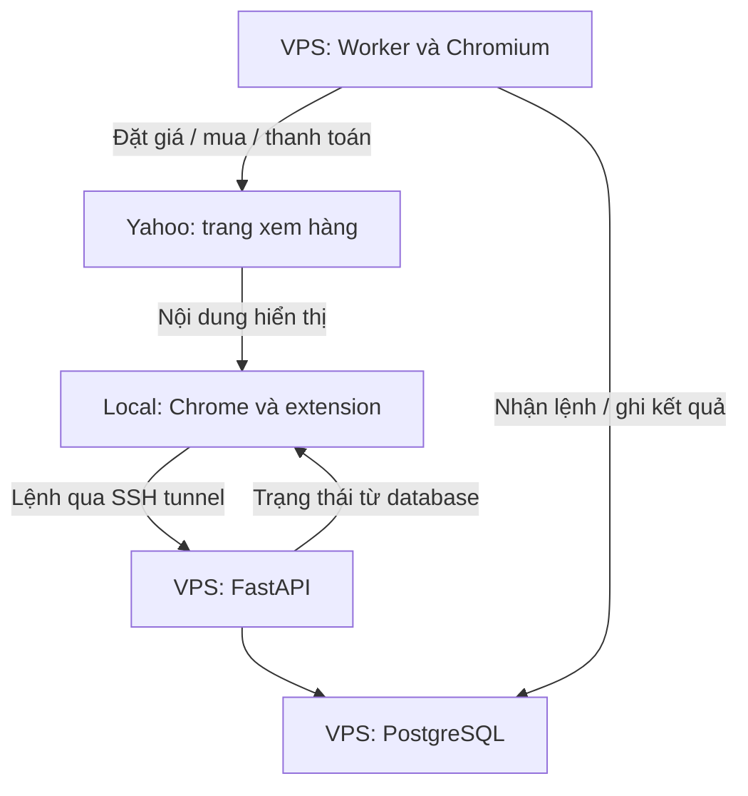

# Yahoo! Auctions: thao tác trên local, VPS Nhật thực hiện

> Đặc tả triển khai, phiên bản 2 — cập nhật ngày 11/09/2026.
> Website mục tiêu: https://auctions.yahoo.co.jp/
> Tài liệu này thay thế toàn bộ bản hướng dẫn mua hàng tổng quát trước đó.

## 1. Mục tiêu đã chốt

Bạn mở Yahoo! Auctions trên máy local để xem hàng cho mượt. Một extension trình duyệt cung cấp nút **“Đặt giá qua VPS”** hoặc **“Mua ngay qua VPS”**. Khi xác nhận, extension gửi lệnh tới VPS Nhật; trình duyệt trên VPS dùng tài khoản đã đăng nhập để thực hiện và trả kết quả.

**Phạm vi IP:** việc xem trang trên local vẫn dùng kết nối của local. Các yêu cầu đặt giá, mua và thanh toán thuộc hệ thống này phải do VPS gửi. Đây không phải cơ chế giấu toàn bộ hoạt động duyệt web local hoặc chỉ đổi IP bằng proxy.

**Nút gốc của Yahoo trên local không tự biến thành lệnh VPS.** Người dùng phải dùng giao diện extension. Bản đầu không ghi đè nút gốc hoặc sao chép cú nhấp chuột giữa hai máy.

Kiến trúc có thể xây dựng. Tích hợp Yahoo chưa được kiểm thử bằng tài khoản thật hoặc trên VPS của bạn; tài liệu không phải mã nguồn đã hoạt động. Chỉ xác nhận triển khai thành công sau khi vượt các cổng nghiệm thu ở mục 16.

### Giả định triển khai

| Hạng mục | Lựa chọn ban đầu |
| --- | --- |
| Máy local | Chrome trên Windows, macOS hoặc Linux |
| Extension | Chrome Manifest V3, popup/trang extension riêng để xác nhận |
| VPS | Linux, có SSH; cần xác minh hệ điều hành và tài nguyên thực tế |
| Backend | Python + FastAPI, worker riêng |
| Lưu trữ | PostgreSQL, volume bền vững |
| Thực thi Yahoo | Playwright + Chromium trên VPS, sau khi kiểm chứng điều kiện sử dụng và tính tương thích |
| Quy mô ban đầu | Một tài khoản, một worker thực thi tuần tự |
| Kết nối | SSH tunnel, API không công khai ra Internet |

Chưa có bằng chứng trong lần khảo sát này về API công khai cho tài khoản của bạn để đặt giá/mua. Không tự giả định Yahoo cung cấp API hoặc idempotency cho những thao tác này. Nếu tìm được API chính thức và quyền sử dụng phù hợp, đánh giá thay adapter trình duyệt.

## 2. Phân biệt nghiệp vụ Yahoo

Hướng dẫn Yahoo mô tả đặt giá với mức tối đa, tự động đấu trong ngân sách đó, mua ngay khi có giá tương ứng và luồng riêng cho hàng giá cố định của cửa hàng. Đây là cơ sở để tách hành động, không dùng một nút “Mua” chung cho mọi trang. [Hướng dẫn đặt giá của Yahoo](https://auctions.yahoo.co.jp/guide/guide/bid02.html)

| Hành động nội bộ | Ý nghĩa thiết kế | Điều kiện xác nhận kết quả |
| --- | --- | --- |
| `PLACE_BID` | Gửi mức giá đấu tối đa do người dùng chọn | Có bằng chứng Yahoo tiếp nhận mức giá của đúng tài khoản và phiên |
| `BUY_NOW` | Thực hiện mua ngay trên listing có luồng này | Có bằng chứng tài khoản đã thắng/mua đúng listing |
| `STORE_CHECKOUT` | Checkout hàng giá cố định của cửa hàng | Có kết quả tạo giao dịch và trạng thái thanh toán riêng |
| `PAY_WON_ITEM` | Thanh toán một giao dịch đã thắng/mua | Xác nhận đúng giao dịch, số tiền và kết quả thanh toán |
| `REFRESH_STATUS` | Chỉ cập nhật trạng thái | Không đặt giá, tạo đơn hoặc thanh toán |

`PLACE_BID` thành công không đồng nghĩa thắng đấu giá. `BUY_NOW` thành công không được tự suy ra đã thanh toán. UI phải thể hiện riêng trạng thái lệnh, đấu giá và thanh toán.

Luồng sau khi thắng khác nhau giữa người bán cá nhân và cửa hàng; có trường hợp phí vận chuyển chưa xác định hoặc cần thêm bước thanh toán. Adapter phải nhận diện loại giao dịch trước khi thao tác. [Hướng dẫn mua và thanh toán của Yahoo](https://auctions.yahoo.co.jp/guide/guide/bid03.html)

Bản đầu hỗ trợ từng loại listing được kiểm thử; loại chưa nhận diện trả `UNSUPPORTED_LISTING_TYPE`. Không tự chuyển từ đặt giá sang mua ngay hay thanh toán.

## 3. Kiến trúc và đường đi của dữ liệu



| Thành phần | Trách nhiệm |
| --- | --- |
| Content script | Nhận diện trang listing; gửi ID gợi ý để mở giao diện extension |
| Popup/trang extension | Hiển thị dữ liệu VPS xác minh, nhập giá, xác nhận hành động và xem kết quả |
| Extension service worker | Gọi API qua tunnel bằng thông tin xác thực riêng; không mua trực tiếp trên Yahoo |
| FastAPI | Xác thực, tạo preview, kiểm tra lệnh, ghi database, trả trạng thái |
| PostgreSQL | Nguồn dữ liệu chính cho lệnh, bằng chứng, khóa nghiệp vụ và ngân sách |
| Worker | Kiểm tra điều kiện, thực thi tuần tự, đối soát sau lỗi |
| Yahoo adapter | Nhận diện listing, quản lý phiên, đặt giá/mua/đối soát trên VPS |
| Giao diện quản trị | Trạng thái kết nối, đăng nhập lại, lệnh chưa rõ, tạm dừng, nhật ký |

API trả nhận lệnh sau khi database commit. Worker hoạt động độc lập với HTTP request, tab trình duyệt và SSH tunnel của local. Không dùng tác vụ nền trong vòng đời API làm hàng đợi duy nhất cho giao dịch.

## 4. Trải nghiệm sử dụng

1. Mở SSH tunnel và extension; kiểm tra API, worker, phiên Yahoo trên VPS.
2. Mở listing Yahoo trên local. Không cần đăng nhập tài khoản mua trên local nếu nội dung xem cho phép.
3. Bấm nút extension để chọn hành động. Nút chèn trong trang chỉ mở phần xem trước, không được phép tự gửi lệnh giao dịch.
4. Extension gửi ID listing tới VPS để lấy preview mới. VPS kiểm tra lại listing và tài khoản; dữ liệu DOM local chỉ là gợi ý.
5. Popup/trang extension hiển thị tên hàng, ID, người bán, loại listing, giá, phí đã biết, thời gian cập nhật và tài khoản thực thi trên VPS.
6. Người dùng nhập mức giá/giới hạn tiền, đọc rõ hành động, rồi xác nhận trong trang thuộc extension.
7. Extension lưu `intent_id`, khóa idempotency và payload trước khi gửi. VPS tiếp nhận và trả `command_id`.
8. Worker thực hiện trên VPS; extension hiển thị tiến trình và bằng chứng kết quả.
9. Khi đóng tab hoặc mất mạng, mở lại extension để tra cứu cùng lệnh. Không tự tạo lệnh mua mới.

Tên nút xác nhận nên cụ thể, ví dụ **“Đặt giá tối đa 12.000 JPY qua VPS”**. Nếu hành động có thể trả tiền ngay, phải hiển thị **“Mua và thanh toán tối đa … JPY qua VPS”**.

Khuyến nghị dùng profile Chrome local riêng để xem hàng, không giữ tài khoản mua. Có thể làm mờ nút gốc như hỗ trợ UX, nhưng không coi thao tác DOM đó là bảo đảm chặn mọi giao dịch local. Nếu yêu cầu tuyệt đối không có giao dịch local, nghiệm thu trên profile không có phiên mua và chỉ thao tác qua extension.

## 5. Thiết kế extension

### 5.1 Phân quyền và giao tiếp

Content script chỉ trích ID listing và yêu cầu mở preview. Background/service worker chỉ nhận message đã định nghĩa như `GET_PREVIEW`, `GET_COMMAND_STATUS`; lệnh thực thi chỉ đến từ popup/trang extension đã xác nhận.

Kiểm tra `sender.id`, URL của sender và schema message. Không nhận lệnh giao dịch qua `window.postMessage` từ website; không mở `externally_connectable` cho Yahoo. Không tin `isTrusted` hoặc nút hiển thị trong DOM là cơ chế xác thực duy nhất.

Request liên nguồn tới API thực hiện từ ngữ cảnh extension với `host_permissions` phù hợp. Content script không nên gọi trực tiếp API vì chịu ràng buộc nguồn của trang; không cho message chỉ định URL tùy ý để background fetch. [Chrome: cross-origin requests](https://developer.chrome.com/docs/extensions/develop/concepts/network-requests)

Quyền cần đánh giá khi viết manifest:

| Quyền/phạm vi | Mục đích |
| --- | --- |
| `activeTab` và `scripting` | Đọc trang đang được người dùng chủ động chọn, nếu dùng cách inject theo yêu cầu |
| Content script match hẹp | Tùy chọn khi cần nút xuất hiện tự động trên trang listing đã xác minh |
| `storage` | Lưu lệnh đang theo dõi và cài đặt không nhạy cảm |
| Host loopback của API | Gọi API qua SSH tunnel; cố định cổng/base URL trong cấu hình đã kiểm tra |

Chỉ chọn cơ chế inject cần thiết; không xin `<all_urls>`, quyền đọc cookie Yahoo hoặc quyền proxy. Domain/path listing thực tế phải được xác minh trước khi chốt manifest. Không hardcode một mẫu ID suy đoán thành điều kiện tương thích toàn website.

### 5.2 Ghép cặp và token

- Dashboard quản trị trên loopback, có đăng nhập, tạo mã ghép cặp một lần, hết hạn ngắn.
- Người dùng nhập mã trong extension; endpoint pairing kiểm tra hạn, giới hạn thử và tiêu thụ mã nguyên tử.
- Cấp token riêng theo thiết bị, chủ sở hữu, tài khoản và scope hành động. Server lưu hash token, hỗ trợ hết hạn/thu hồi.
- Bản đầu giữ token trong bộ nhớ phiên extension hoặc `chrome.storage.session`, chỉ cho ngữ cảnh extension tin cậy truy cập; không lưu trong DOM, `localStorage` của Yahoo hay `storage.sync`.
- Khi khởi động lại trình duyệt, ghép cặp/đăng nhập lại nếu token không còn. Nếu sau này cần lưu bền, thiết kế kho bí mật của hệ điều hành; không mặc định storage extension là kho mã hóa.
- Token không truyền qua URL, query string, log hoặc content script.

API yêu cầu bearer token cho extension; dashboard dùng cơ chế session riêng. Origin/CORS chỉ là lớp bổ sung, không thay thế token. Từ chối request mutation dạng form hoặc thiếu content type/schema; không cho trang web bất kỳ lợi dụng endpoint loopback.

### 5.3 Khôi phục sau khi extension ngừng hoạt động

Service worker extension có thể bị dừng; không giữ dữ liệu quan trọng chỉ trong biến toàn cục. Lưu ý định/payload/command ID trước và sau mỗi bước, khôi phục từ storage rồi đối chiếu với VPS khi mở lại UI. [Chrome: service worker lifecycle](https://developer.chrome.com/docs/extensions/develop/concepts/service-workers/lifecycle)

Chỉ poll trạng thái local–VPS khi UI cần; không yêu cầu service worker sống mãi hoặc dùng timer trong local để canh mua. Nếu không xác định request trước đã được tiếp nhận, tìm theo `intent_id` hoặc gửi lại cùng khóa/payload.

## 6. Kết nối và triển khai VPS

FastAPI chạy trực tiếp trên `127.0.0.1:8000` của VPS. Local mở tunnel, thay `VPS_USER` và `VPS_IP` bằng giá trị thật:

```bash
ssh -N \
  -L 127.0.0.1:18000:127.0.0.1:8000 \
  -o ExitOnForwardFailure=yes \
  -o ServerAliveInterval=30 \
  -o ServerAliveCountMax=3 \
  VPS_USER@VPS_IP
```

Extension dùng base URL `http://127.0.0.1:18000`. HTTP chỉ dùng trên loopback; đoạn mạng giữa local và VPS được tunnel mã hóa. Nếu đổi sang truy cập mạng trực tiếp, phải dùng HTTPS hoặc mạng riêng được xác thực và đánh giá lại cấu hình trình duyệt.

Dùng SSH key, xác minh host key và tài khoản không phải root. `-L` chuyển tiếp cổng local; tunnel khởi tạo thành công chưa chứng minh API/worker khỏe. [OpenSSH](https://man.openbsd.org/ssh)

| Dịch vụ | Yêu cầu chạy |
| --- | --- |
| API | systemd hoặc container, tự khởi động lại; không thực thi browser trong request |
| Worker | Một tiến trình chủ động, tự khởi động sau reboot; đối soát trước khi nhận mua mới |
| PostgreSQL | Volume bền vững, migration, backup và diễn tập phục hồi |
| Chromium | Chạy bằng user không phải root, giữ sandbox; browser/profile tương thích bản Playwright đã ghim |
| Phiên xác minh | Browser có giao diện trên VPS qua kênh riêng khi cần; không công khai VNC/CDP |

Nếu dùng Docker, app trong container nghe `0.0.0.0:8000`, publish bằng `127.0.0.1:8000:8000`. Database không publish ra Internet. Ghim phiên bản dependency và browser sau khi kiểm thử; không tự dùng `latest` khi triển khai lại.

Cấu hình CPU/RAM tối thiểu chưa chốt khi chưa biết VPS. Đo khả năng chạy một browser, API và database ổn định; nếu VPS nghẽn CPU/RAM thì giảm truyền màn hình không tự giải quyết tốc độ xử lý trên VPS.

## 7. API và hợp đồng dữ liệu

Đây là API tự xây của hệ thống, không phải endpoint Yahoo.

| Endpoint | Chức năng |
| --- | --- |
| `POST /api/previews` | VPS tra cứu listing và trả dữ liệu xem trước, không giao dịch |
| `POST /api/commands` | Gửi lệnh đã xác nhận; bắt buộc `Idempotency-Key` |
| `GET /api/commands/{id}` | Trạng thái lệnh và kết quả nghiệp vụ |
| `GET /api/commands?intent_id=...` | Tìm lại lệnh sau khi mất phản hồi |
| `POST /api/commands/{id}/cancel` | Chỉ hủy nguyên tử khi còn `QUEUED` |
| `POST /api/commands/{id}/resume` | Tiếp tục đúng phase sau xác minh, không bỏ qua hết hạn |
| `POST /api/commands/{id}/reconcile` | Đối soát, không tạo giao dịch mới |
| `GET /api/accounts/{id}/status` | Trạng thái phiên và khả năng thực thi đã xác minh |
| `GET /api/health` | Sức khỏe API, database, worker |
| `POST /api/pairing/exchange` | Đổi mã ghép cặp một lần thành token giới hạn |

Preview lưu server-side, có `preview_id`, chủ sở hữu, tài khoản, ID listing, loại hành động, phiên bản dữ liệu, thời điểm lấy và hạn hiệu lực. ID do server cấp, không dùng hash DOM của local như bằng chứng tin cậy.

Ví dụ payload đặt giá; các ID bên dưới chỉ là dữ liệu minh họa:

```json
{
  "intent_id": "a35b9af8-94b1-4d40-991b-89a8ee5dd68a",
  "account_id": "yahoo-jp-01",
  "auction_id": "EXAMPLE_AUCTION_ID",
  "preview_id": "EXAMPLE_PREVIEW_ID",
  "action": "PLACE_BID",
  "currency": "JPY",
  "max_bid_jpy": 12000,
  "max_total_jpy": 13500,
  "unknown_cost_policy": "BLOCK",
  "expires_in_seconds": 120,
  "dry_run": true
}
```

| Hành động | Trường tiền và tham chiếu bắt buộc |
| --- | --- |
| `PLACE_BID` | `max_bid_jpy`, `max_total_jpy`, preview hợp lệ |
| `BUY_NOW` | `max_item_price_jpy`, `max_total_jpy`, preview xác nhận đúng luồng mua ngay |
| `STORE_CHECKOUT` | `max_total_jpy`, địa chỉ, phương thức giao/chi trả và quyền chi tiền rõ ràng |
| `PAY_WON_ITEM` | `trade_ref`, `max_total_jpy`, địa chỉ/phương thức liên quan và preview thanh toán riêng |

Mỗi action có schema riêng, từ chối trường lạ hoặc tổ hợp không hợp lệ. Tiền JPY là số nguyên dương, không dùng float. Không gửi cookie Yahoo, OTP, mật khẩu hoặc số thẻ trong lệnh.

Mẫu phản hồi trạng thái nội bộ:

```json
{
  "command_id": "ce6be02f-5e7d-4253-b8f5-10d52ba03fb8",
  "command_status": "SUCCEEDED",
  "action": "PLACE_BID",
  "auction_status": "BID_ACCEPTED",
  "payment_status": "NOT_STARTED",
  "last_verified_at": "2026-09-11T10:00:00Z"
}
```

Không yêu cầu có mã đơn mới kết luận được lệnh đặt giá; dùng bằng chứng tài khoản/auction/mức giá. Với checkout/thanh toán, lưu mã giao dịch nếu Yahoo cung cấp và tham chiếu có thể đối chiếu. Không tự tạo “mã đơn Yahoo” giả.

Quy tắc: `202` = đã commit lệnh; cùng khóa và payload = trả lệnh cũ; cùng khóa khác payload = `409`; dữ liệu sai = `422`; chưa xác thực = `401`; thiếu quyền = `403`. Retry lệnh đã tồn tại phải trả kết quả cũ kể cả preview đã hết hạn; không kiểm tra preview hết hạn trước bước tra khóa trùng.

## 8. Hạn mức, chi phí và thời gian

### Giá và chi phí

- `max_bid_jpy` là trần mức đấu, không phải cam kết tổng tiền cuối cùng.
- `max_total_jpy` bao gồm tiền hàng, thuế và các khoản phí thuộc giao dịch mà adapter đã xác minh.
- Mặc định `unknown_cost_policy=BLOCK`: thiếu phí cần thiết hoặc không tính được trần tổng thì dừng, không coi phí chưa biết bằng 0.
- Với đặt giá, kiểm tra tổng trong kịch bản thắng ở mức tối đa. Không trừ coupon chưa chắc áp dụng.
- Nếu cần cho phép đấu khi chưa biết phí, triển khai thành chế độ riêng có xác nhận rõ giới hạn; không bật trong bản đầu.
- Chi phí vận chuyển quốc tế/dịch vụ ngoài giao dịch Yahoo không được mặc định nằm trong tổng. Hiển thị rõ phạm vi khi preview.
- Nếu website không hỗ trợ điều kiện tiền nguyên tử, kiểm tra ngay trước bước xác nhận và ghi nhận giới hạn bảo đảm. Không cam kết khóa giá chỉ bằng việc đọc trang trước đó.

Có hạn mức theo tài khoản và tổng nghĩa vụ tiềm năng. Khi chấp nhận nhiều lệnh đấu, dự trữ ngân sách theo khả năng thắng tất cả; cập nhật dự trữ nguyên tử trong database. Không giải phóng tiền dự trữ chỉ vì local mất mạng hoặc mới thấy bị vượt giá; chỉ giải phóng khi đã xác minh hết nghĩa vụ theo nghiệp vụ. Lệnh `UNKNOWN` giữ dự trữ tới khi đối soát.

Nâng trần giá là ý định mới được xác nhận, liên kết với lần trước. Khóa `(account_id, auction_id)` ngăn hai lệnh giá khác nhau tranh nhau; một lần tăng trần chỉ dự trữ phần chênh lệch nếu bằng chứng trạng thái trước đủ chắc chắn. Không tự tăng giá khi đối thủ vượt.

### Thời gian

Lưu timestamp UTC, hiển thị thêm `Asia/Tokyo` và `Asia/Ho_Chi_Minh`. Đồng bộ giờ VPS. `expires_at` tính theo server ở lần nhận đầu; retry hoặc resume không tự gia hạn.

Thời điểm kết thúc lấy lại từ Yahoo khi kiểm tra, không chỉ tin đồng hồ đếm ngược trên local. Nếu listing có gia hạn, theo trạng thái mới của listing. Bản đầu gửi ngay khi xác nhận; không có tính năng canh giây cuối và không cam kết thắng đấu giá.

Hết TTL chỉ ngăn một lệnh chưa thực thi. Nó không rút mức giá đã được Yahoo tiếp nhận hoặc dừng cơ chế đấu của Yahoo. Yahoo hướng dẫn cơ bản không cho người mua tự hủy giá đã đặt; vì vậy nút hủy của hệ thống chỉ hủy công việc chưa chạy. [Yahoo Q&A](https://auctions.yahoo.co.jp/guide/guide/qa.html)

## 9. Độ tin cậy và trạng thái

### 9.1 Chống gửi trùng

1. Unique constraint `(owner_id, idempotency_key)` và `(owner_id, intent_id)`.
2. Hash payload chuẩn hóa, gồm action, tài khoản, listing, tiền, preview và dry-run.
3. Tra khóa trùng trước, sau đó mới kiểm tra điều kiện tạo lệnh mới.
4. Ghi lệnh và dự trữ ngân sách cùng transaction; commit rồi mới trả nhận lệnh.
5. Extension giữ nguyên khóa/payload khi retry. UI mở lại không tự tạo ý định mới.
6. Một tài khoản chỉ có một luồng ghi giao dịch; khóa xuyên tiến trình và bảo vệ browser profile.
7. Nếu website không hỗ trợ idempotency thì không suy diễn khóa của hệ thống có hiệu lực bên Yahoo.

API không trùng lệnh chưa đủ bảo đảm giao dịch ngoài chỉ xảy ra một lần. Sau khi Yahoo nhận thao tác mà VPS mất kết quả, cần đối soát trước mọi lần gửi lại.

### 9.2 Trạng thái lệnh và nghiệp vụ

| `command_status` | Cách xử lý |
| --- | --- |
| `QUEUED` | Lưu bền vững, còn có thể hủy |
| `PRECHECK` | Kiểm tra trước thao tác có thể thay đổi giao dịch |
| `WAITING_USER` | Cần xác minh; lưu cả phase và khả năng đã gửi thao tác |
| `SUBMITTING` | Đã ghi bền vững ý định submit; có thể Yahoo đã nhận |
| `RECONCILING` | Đang tra cứu bằng chứng |
| `SUCCEEDED` | Hành động cụ thể đã xác nhận thành công |
| `DRY_RUN_SUCCEEDED` | Chỉ kiểm tra; không phải đấu/mua thật |
| `FAILED` | Có bằng chứng hành động không có hiệu lực |
| `UNKNOWN` | Không đủ bằng chứng; khóa hành động xung đột và giữ ngân sách |
| `CANCELLED` | Hủy trước khi worker nhận |
| `EXPIRED` | Hết hạn trước bước submit |

Tách `auction_status`: `NOT_BID`, `BID_ACCEPTED`, `LEADING`, `OUTBID`, `WON`, `LOST`, `CLOSED`, `UNKNOWN`. Tách `payment_status`: `NOT_STARTED`, `PENDING`, `PAID`, `FAILED`, `UNKNOWN`. Đây là enum của phần mềm, không phải tên trường API Yahoo.

Ghi `last_verified_at` cho từng nhóm trạng thái; không biến dữ liệu cũ thành trạng thái “hiện tại”. Một lệnh đặt giá có thể đã hoàn thành nhưng worker vẫn theo dõi kết quả đấu bằng tác vụ chỉ đọc.

### 9.3 Worker, khóa và phục hồi

Nhận lệnh bằng transaction ngắn, có thể dùng `FOR UPDATE SKIP LOCKED` khi cần nhiều consumer. Cơ chế này hỗ trợ nhận hàng đợi; khóa bản ghi lúc nhận không giữ độc quyền cả phiên browser. [PostgreSQL SELECT](https://www.postgresql.org/docs/current/sql-select.html)

Bản đầu dùng một worker được supervisor quản lý và khóa tài khoản/profile. Không triển khai failover tự động sang worker khác chỉ vì heartbeat hết hạn. Database không thể ngăn một browser cũ tiếp tục gửi tới Yahoo; muốn tiếp quản phải xác minh tiến trình/browser cũ đã dừng rồi đối soát giao dịch chưa rõ.

Trước bước có thể đặt giá, tạo đơn hoặc trả tiền: kiểm tra quyền thực thi, hạn lệnh và ngân sách; ghi `SUBMITTING` cùng phase rồi commit. Không mở transaction database suốt thời gian chờ website.

Sau crash/reboot:

- `QUEUED`: tiếp tục nếu còn hạn.
- `PRECHECK`: chỉ chạy lại khi chứng minh chưa submit và worker cũ đã dừng.
- `SUBMITTING` hoặc `WAITING_USER` sau submit: chuyển đối soát, không đưa về hàng đợi mua.
- Không đọc được bằng chứng: giữ `UNKNOWN`; không báo thất bại chỉ vì timeout.
- Hành động liên quan cùng tài khoản/listing bị chặn tới khi giải quyết lệnh chưa rõ.

Đối soát dùng phiên tài khoản trên VPS: đúng auction, mức giá đã tiếp nhận nếu có, kết quả thắng và trạng thái giao dịch. Chỉ thấy giá công khai không đủ chứng minh mức giá tối đa của tài khoản. Nếu Yahoo không cung cấp bằng chứng đủ phân biệt, yêu cầu người dùng kiểm tra qua browser VPS, ghi nhận quyết định có lịch sử; không tự submit lại.

## 10. Adapter Yahoo và phiên đăng nhập

Thiết kế các chức năng riêng, không đặt selector website vào API handler:

| Hàm nội bộ | Trách nhiệm |
| --- | --- |
| `check_session(account)` | Xác nhận tài khoản thực tế và trạng thái đăng nhập |
| `get_listing(auction_id)` | Xác minh ID, người bán, loại listing, giá, phí và hạn |
| `prepare(action, command)` | Chuẩn bị tới trước ranh giới giao dịch, tạo bằng chứng preview |
| `submit_bid(command)` | Gửi mức đấu đã duyệt |
| `submit_buy_now(command)` | Thực hiện đúng luồng mua ngay được hỗ trợ |
| `submit_store_checkout(command)` | Checkout cửa hàng với quyền thanh toán rõ ràng |
| `submit_payment(command)` | Thanh toán giao dịch đã xác minh |
| `reconcile(command)` | Chỉ đọc, xác nhận kết quả và giới hạn bằng chứng |

Đăng nhập lần đầu trong browser trên VPS. Dùng cùng profile/session khi xác minh; không copy cookie từ local rồi mặc định đăng nhập luôn hợp lệ. Playwright có thể tái sử dụng trạng thái đăng nhập nhưng file chứa dữ liệu nhạy cảm và không bao phủ mọi cơ chế phiên. [Playwright authentication](https://playwright.dev/python/docs/auth)

Nếu gặp OTP/CAPTCHA/passkey/xác minh thanh toán, chuyển `WAITING_USER`. Người dùng hoàn thành qua phương thức chính thức trên thiết bị phù hợp; request giao dịch tiếp tục từ browser VPS. Nếu xác minh bắt buộc điều kiện VPS không đáp ứng, ghi rõ tính năng bị chặn, không tìm cách vượt xác thực.

Khi người dùng tiếp quản browser, worker phải nhường quyền độc quyền. Sau khi trả quyền, worker kiểm tra lại phase và lịch sử trước khi tiếp tục vì người dùng có thể đã hoàn thành thao tác.

Dùng locator ngữ nghĩa hoặc selector ổn định được khảo sát thật; không coi nhãn nút trong tài liệu hướng dẫn là selector đã kiểm thử. Kiểm tra trang xác nhận đúng tài khoản, auction và số tiền. Không thử selector dự phòng bằng cách bấm hàng loạt nút có khả năng tạo giao dịch.

Allowlist domain cho điều hướng worker dựa trên luồng đã xác minh, gồm những domain xác thực/chi trả thực sự cần. Chặn URL tùy ý, redirect lạ và truy cập mạng nội bộ không liên quan. Không sử dụng API nội bộ suy đoán hoặc kỹ thuật che giấu tự động hóa để vượt hạn chế.

## 11. Mua và thanh toán: quy tắc quyền hạn

Xác nhận lệnh đặt giá chỉ cho phép đặt mức giá đó. Nó không tự cấp quyền thanh toán sau khi thắng. `PAY_WON_ITEM` là lệnh mới, preview mới, mã ý định mới và giới hạn tiền riêng.

Với listing có checkout gộp mua và trả tiền, UI phải yêu cầu quyền cho cả hai trước khi submit. Nếu người dùng chỉ cho phép mua mà luồng không tách được thanh toán, trả `PAYMENT_AUTH_REQUIRED` và dừng.

Không tự đổi phương thức trả tiền, địa chỉ, áp coupon có điều kiện khác, liên hệ người bán hoặc xác nhận đã nhận hàng. Phạm vi mở rộng phải có hành động và quyền riêng.

Nếu phương thức thanh toán đòi hỏi bước ngoài browser, UI hiển thị `PENDING` và hướng dẫn phù hợp theo trạng thái thật; không cam kết mọi thanh toán đều thực hiện hoàn toàn qua VPS. Bản đầu chỉ bật phương thức đã kiểm thử.

## 12. Dữ liệu, log và vận hành

| Bảng | Nội dung |
| --- | --- |
| `accounts` | Chủ sở hữu, định danh Yahoo đã xác minh, tham chiếu profile, hạn mức |
| `devices` | Token hash, scope, hạn và trạng thái thu hồi |
| `previews` | Dữ liệu đã kiểm chứng, owner/account/action, thời hạn |
| `commands` | Ý định, idempotency, hash payload, phase, trạng thái, thời hạn |
| `command_events` | Lịch sử chuyển trạng thái và người/tiến trình thực hiện |
| `auction_positions` | Trạng thái đấu theo account/auction, lần xác minh gần nhất |
| `budget_reservations` | Ngân sách đang giữ, liên kết lệnh và nghĩa vụ |
| `trade_results` | Tham chiếu giao dịch, số tiền, trạng thái chi trả, bằng chứng |

Không xóa bản ghi chống trùng trong thời gian có thể retry hoặc còn nghĩa vụ đấu/mua. Khi phục hồi backup cũ, tạm khóa giao dịch và đối soát Yahoo trước khi tiếp tục.

Log có command ID, action, phase và lỗi đã làm sạch. Không ghi cookie, token, OTP, mật khẩu, số thẻ hoặc toàn bộ response có thông tin cá nhân. Ảnh lỗi phải hạn chế truy cập, che dữ liệu và có thời hạn lưu.

Dashboard hiển thị độ dài hàng đợi, tuổi lệnh, nhịp worker, phiên đăng nhập, lệnh `UNKNOWN`, ngân sách đang giữ và thời gian xác minh. Có nút tạm dừng lệnh mới; nút này không hủy giá đã đặt hay thu hồi giao dịch đã gửi.

Poll extension–API có thể bắt đầu mỗi 2 giây khi mở UI. Worker đọc Yahoo theo khoảng phù hợp đã đánh giá, cache dữ liệu và backoff khi lỗi/throttle; không đồng nhất việc UI poll với việc phải tải Yahoo liên tục.

## 13. Tổ chức mã nguồn cần bàn giao

| Đường dẫn tương đối | Nội dung |
| --- | --- |
| `extension/manifest.json` | Quyền và cấu hình Manifest V3 |
| `extension/content.js` | Nhận diện listing/mở preview, không thực thi giao dịch |
| `extension/background.js` | Gọi API, kiểm tra message, quản lý token theo phiên |
| `extension/popup.html`, `popup.js` | Preview, xác nhận, trạng thái |
| `backend/api/` | Xác thực, pairing, preview, command endpoints |
| `backend/domain/` | Schema action, ngân sách, trạng thái, idempotency |
| `backend/worker/` | Nhận lệnh, khóa, heartbeat, đối soát và phục hồi |
| `backend/adapters/yahoo/` | Các luồng Yahoo đã kiểm thử |
| `backend/adapters/mock/` | Mô phỏng lỗi và ranh giới giao dịch |
| `migrations/` | Schema, unique constraint và index |
| `deploy/` | systemd hoặc Compose, cấu hình tunnel, backup |
| `tests/` | Kiểm thử độ tin cậy, extension và tích hợp |
| `docs/runbook.md` | Cài đặt, đăng nhập, xử lý lỗi, phục hồi |
| `.env.example` | Tên cấu hình, không chứa bí mật |

Chưa có mã nguồn các file này trong deliverable hiện tại; đây là danh mục cho bước lập trình. Với adapter chưa hoàn thành, mặc định `LIVE_ACTIONS_ENABLED=false`; endpoint giao dịch thật báo chưa cấu hình, không trả thành công giả.

## 14. Lộ trình triển khai

1. **Khảo sát:** kiểm tra VPS, Chrome local, tài khoản Yahoo, loại listing mục tiêu và luồng xác minh. Chọn một luồng cụ thể làm đầu tiên.
2. **Nền tảng:** dựng API/database/worker, SSH tunnel, pairing và extension; chạy adapter mock.
3. **Độ tin cậy:** hoàn thiện transaction, idempotency, budget, khóa, phase và crash recovery.
4. **Đọc thật:** đăng nhập trên VPS, lấy preview listing thật và kiểm chứng account/auction/IP.
5. **Dry-run:** chuẩn bị đúng luồng rồi dừng trước ranh giới đặt giá/mua/trả tiền. Không gửi giá nhỏ để giả làm dry-run.
6. **Tích hợp giao dịch:** kiểm thử một hành động thật được người dùng chủ động cho phép. Không giả định Yahoo có sandbox; dùng mock cho thử lỗi nếu chưa xác minh được môi trường thử chính thức.
7. **Mở rộng:** thêm BUY_NOW, checkout cửa hàng hoặc thanh toán sau khi từng luồng có bằng chứng nghiệm thu riêng.
8. **Vận hành:** ghim dependency/browser, backup, giám sát, hướng dẫn xác minh lại và cập nhật adapter khi Yahoo đổi giao diện.

Mỗi khả năng được bật riêng theo account/loại listing/phương thức thanh toán đã kiểm thử. Không bật toàn bộ các action chỉ vì một lần đặt giá đã thành công.

## 15. Bảng kiểm thử bắt buộc

| Tình huống | Kết quả mong đợi |
| --- | --- |
| Bấm nút xem trước trong trang | Chỉ mở UI extension, không đặt giá/mua |
| Trang giả gửi message hoặc sửa DOM | Không thể tạo lệnh giao dịch; VPS xác minh lại ID và dữ liệu |
| Preview cũ, sai tài khoản hoặc khác action | Chặn lệnh mới và yêu cầu preview đúng |
| Bấm 10 lần cùng ý định/khóa | Một lệnh và một luồng thực thi |
| Cùng khóa nhưng đổi giá/dry-run | `409`, không thay lệnh trước |
| Cùng intent nhưng khác khóa | Trả lệnh cũ nếu payload khớp, nếu không thì xung đột |
| Extension worker bị dừng hoặc đóng tab | Mở lại tìm được cùng lệnh từ storage/VPS |
| API commit rồi mất phản hồi | Retry cùng mã trả lệnh đã lưu |
| Database không commit được | Không báo đã nhận, không submit Yahoo |
| Local mất mạng sau khi gửi | VPS tiếp tục theo hạn và phase; không tự tạo ý định mới |
| Worker chết ngay trước/sau submit | Phục hồi phân biệt phase; sau submit phải đối soát |
| Worker cũ còn browser hoạt động | Không tự failover tạo browser thứ hai để submit |
| Yahoo timeout sau đặt giá | Giữ `UNKNOWN`/đối soát, không tự nâng trần hoặc gửi lại |
| Đặt giá được tiếp nhận nhưng bị vượt | Không báo thắng; không tự tăng giá |
| Listing đổi loại/đã đóng/thay giá | Đọc lại và chặn hành động không còn phù hợp |
| Cần thuế/phí nhưng chưa xác định | `BLOCK`, không coi là phí bằng 0 |
| Nhiều phiên có thể cùng thắng | Không vượt hạn mức nghĩa vụ tiềm năng đã đặt |
| Lệnh hết hạn sau khi Yahoo đã nhận giá | Không báo giá đã bị rút; tiếp tục theo dõi nghĩa vụ |
| Phiên đấu đổi giờ kết thúc | Cập nhật từ website, không kết luận thắng dựa trên timer local |
| OTP/xác minh xuất hiện | Chờ người dùng trên luồng phù hợp; không gửi giao dịch lặp |
| Người dùng thao tác khi tiếp quản browser | Worker đối soát sau khi lấy lại quyền |
| Store checkout có thể trả tiền ngay | Cần quyền mua + trả tiền và hạn mức phù hợp |
| Thanh toán còn chờ bước ngoài | `PENDING`, không hiển thị `PAID` |
| Token bị thu hồi hoặc request khác owner | API từ chối |
| Profile local không đăng nhập mua | Các lệnh hệ thống vẫn dùng đúng tài khoản VPS |
| VPS reboot hoặc restore backup | Không mất lệnh đã lưu bình thường; restore cũ phải đối soát trước live |

Test retry/crash tài chính trên mock hoặc môi trường thử được xác nhận, không lặp thao tác thật để thử lỗi. Dry-run dùng ý định riêng; chuyển sang live bằng ý định mới và xác nhận mới.

## 16. Nghiệm thu và bằng chứng

### Cổng A — Hạ tầng

- [ ] Local kết nối API qua tunnel; API không lộ public ngoài ý muốn.
- [ ] Token/owner/scope được kiểm tra; endpoint local không nhận lệnh từ trang bất kỳ.
- [ ] Lệnh được lưu trước phản hồi và tìm lại sau restart.
- [ ] Extension có thể khôi phục sau khi service worker dừng.

### Cổng B — Yahoo chỉ đọc và dry-run

- [ ] Đăng nhập thành công trên VPS và xác minh đúng tài khoản.
- [ ] Đọc đúng ID listing, loại luồng, số tiền/chi phí và hạn.
- [ ] Preview mới và xác nhận đúng action.
- [ ] Dry-run dừng trước thao tác có thể đặt giá/tạo giao dịch/giữ tiền.
- [ ] Có hướng xử lý xác minh khả thi với tài khoản và thiết bị thực tế.

### Cổng C — Giao dịch thực tế

- [ ] Người dùng chủ động cho phép hành động thật cụ thể.
- [ ] Có bằng chứng đúng auction/tài khoản/mức giá hoặc tham chiếu giao dịch.
- [ ] Trạng thái đặt giá, thắng và chi trả hiển thị tách biệt, đúng thực tế.
- [ ] Các ca crash/retry đã qua mock; tích hợp thật không được suy diễn từ mock.

### Cổng D — Nơi thực thi

- [ ] Log và trace đã làm sạch cho thấy thao tác giao dịch nằm trong worker/browser VPS.
- [ ] Endpoint chẩn đoán do người triển khai kiểm soát ghi IP nguồn từ chính context/client thực thi trên VPS.
- [ ] Kiểm tra proxy, NAT, IPv4/IPv6 và tuyến của request giao dịch; không chỉ nhìn IP SSH.
- [ ] Kiểm tra network local: request duyệt Yahoo có thể tồn tại, nhưng extension không gọi trực tiếp thao tác đặt giá/mua/chi trả của Yahoo.

IP ra mạng VPS có thể là IP NAT của nhà cung cấp; IP đặt tại Nhật không bảo đảm Yahoo chấp nhận datacenter hoặc xác định vị trí như mong muốn. Đối chiếu endpoint IP là bằng chứng hỗ trợ, không thay thế kiểm chứng tiến trình và request giao dịch.

### Cổng E — Bàn giao vận hành

- [ ] Có mã nguồn, lockfile, migration, cấu hình mẫu và hướng dẫn triển khai.
- [ ] Có log đã che dữ liệu, backup và diễn tập phục hồi.
- [ ] Có cơ chế giải quyết `UNKNOWN`, đăng nhập lại, tạm dừng và thu hồi thiết bị.
- [ ] Báo cáo ghi rõ action/loại listing/phương thức thanh toán nào đã và chưa kiểm thử.

**Trạng thái hiện tại:** hoàn thành đặc tả. Chưa truy cập VPS, chưa cài extension, chưa đăng nhập Yahoo, chưa đặt giá/mua/chi trả. Những mục nghiệm thu chưa đánh dấu là công việc cần thực hiện, không phải kết quả đã đạt.

## 17. Thông tin cần trước khi lập trình và chạy thật

| Thông tin còn thiếu | Ảnh hưởng |
| --- | --- |
| Hệ điều hành, CPU/RAM/dung lượng VPS | Cách cài browser và quản lý dịch vụ |
| Hệ điều hành/phiên bản Chrome local | Quyền extension, loopback và cách mở tunnel |
| Một URL listing mẫu, không cần mua | Khảo sát ID, DOM và loại luồng thực tế |
| Ưu tiên đấu giá, mua ngay hay cửa hàng | Chọn action đầu tiên để triển khai |
| Trạng thái đăng nhập/xác minh tài khoản trên VPS | Xác định khả năng thực thi và bước cần người dùng |
| Mức tiền tối đa và ngân sách tổng | Cấu hình kiểm soát trước khi gửi |
| Địa chỉ/phương thức thanh toán được dùng | Xác minh phần phí và checkout |

Không cần đưa mật khẩu, cookie, OTP hoặc số thẻ vào tài liệu. Những dữ liệu đó được nhập qua kênh phù hợp khi triển khai.

**Kết quả cần đạt:** bạn xem hàng trên local, xác nhận trong extension, VPS thực hiện hành động đã chọn và trả bằng chứng. Hệ thống giảm lag do không truyền màn hình liên tục; không bảo đảm thắng đấu giá, không loại bỏ độ trễ mạng và không tuyên bố giao dịch ngoài “exactly-once” nếu không có cơ chế chứng minh tương ứng.
